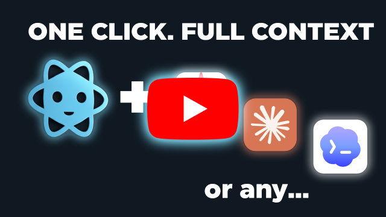
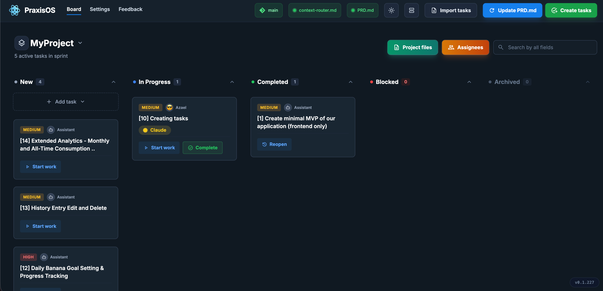
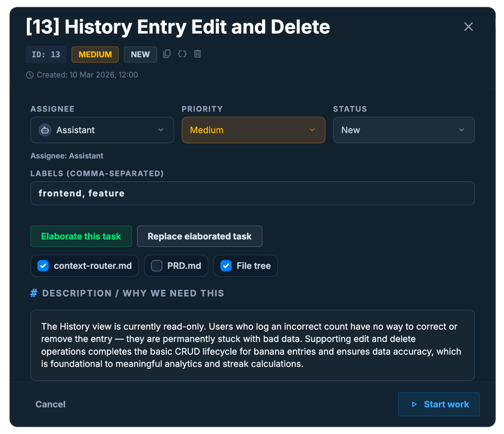
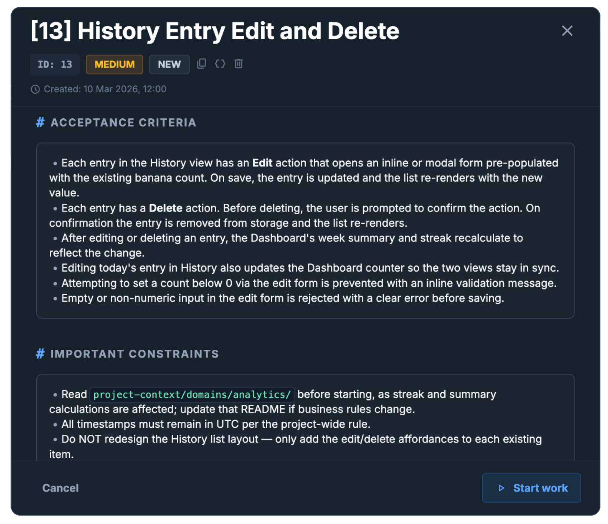
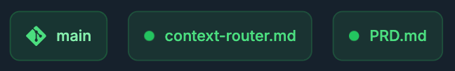

  <strong>PraxisOS</strong> 
  Stop re-explaining your project to AI. Start shipping.

  

  
  
  

---
Your local OS for human-AI collaboration. Zero cloud, Git-native task management, and one-click perfect prompts.

Every AI coding session starts the same way: you re-explain your architecture, paste your project rules, copy-paste context from six different files. By the time the AI understands your project, you've burned 10 minutes and half your energy. Tomorrow you'll do it all over again.

**PraxisOS fixes this.** It's a local kanban board that lives inside your project directory and generates one-click AI-ready prompts with your full project context baked in. No cloud, no accounts, no telemetry  -  everything stays on your machine, tracked by Git.

---

  
   <em>Watch Praxis OS showcase in action (120 sec)</em>

---

## See It in Action

<!-- ============================================================
  PLACEHOLDER: GIF #1  -  "Start Work" Workflow
  ============================================================
  A GIF animation (under 5 MB, 15-20 fps, 1440x900 or 1280x800,
  dark theme) showing the core "magic moment":

  1. User opens a local project directory
  2. The kanban board loads with real-looking tasks
  3. User clicks "Start Work" on a task
  4. The AI-ready prompt is copied  -  clipboard notification appears

  File location when ready:
    media/gifs/start-work-workflow.gif

  Replace this comment block with:
    

      
       <em>Open your project → Click "Start Work" → Full-context prompt copied to clipboard</em>
    

  ============================================================ -->

<!-- ============================================================
  PLACEHOLDER: GIF #2  -  Task Creation & Elaboration
  ============================================================
  A GIF animation (under 5 MB, 15-20 fps, 1440x900 or 1280x800,
  dark theme) showing the elaboration flow:

  1. User creates a new task via "Quick create" in the New column
  2. User clicks "Elaborate task"
  3. The elaborated task JSON appears with acceptance criteria,
     edge cases, and implementation notes
  4. User imports the elaborated result into the board

  File location when ready:
    media/gifs/task-elaboration-workflow.gif

  Replace this comment block with:
    

      
       <em>Quick-create a task → AI elaborates it into a full spec → Import back to the board</em>
    

  ============================================================ -->

---

## How to Get Started

<!-- ============================================================
  PLACEHOLDER: Screenshot #1  -  Main Kanban Board
  ============================================================
  A static screenshot (PNG, 1440x900 or higher, dark theme)
  showing the main kanban board populated with realistic,
  plausible task titles across multiple columns (New, In Progress,
  Completed, Blocked). Tasks should have varied priorities,
  labels, and assignees to showcase the full board experience.
  ============================================================ -->

1. **Open [praxisos.dev](https://praxisos.dev/)** in a Chromium-based browser (Chrome, Edge, Brave, or Arc).
2. **Select your project directory.** PraxisOS creates a `.praxis/` folder to store tasks and configuration.
3. **Create a task.** Write a one-liner. PraxisOS generates a full spec with acceptance criteria, edge cases, and implementation notes  -  all grounded in your project's architecture and PRD.
4. **Start work with one click.** Hit "Start work" and PraxisOS copies a context-rich prompt to your clipboard  -  including your architectural rules, file tree, and task details. Paste it into Cursor, Claude, Copilot, or any AI tool.

Define your project's architectural rules once in `context-router.md`  -  every prompt PraxisOS generates includes them automatically.

> **Note:** PraxisOS uses the [File System Access API](https://developer.chrome.com/docs/capabilities/web#file_system_access_api), which requires a Chromium-based browser. Safari and Firefox are not supported.

---

## Features

<!-- ============================================================
  PLACEHOLDER: Screenshot #2  -  Task Detail View
  ============================================================
  A static screenshot (PNG, 1440x900 or higher, dark theme)
  showing an open task detail panel with:
  - A realistic task title and description
  - Filled-in acceptance criteria (markdown rendered)
  - Visible priority, labels, and assignee fields
  - The "Start Work" button visible
  ============================================================ -->

- **Git-Native Tasks**  -  Tasks are JSON files in `.praxis/tasks/`. They diff, merge, branch, and travel with your repo. No vendor lock-in.
- **One-Click AI Prompts**  -  Select a task, click "Start work", get a clipboard-ready prompt with full project context.
- **Context Router**  -  Define architectural rules once. Every AI prompt includes them automatically.
- **AI Task Elaboration**  -  Turn a one-line idea into a full spec with acceptance criteria, edge cases, and testing steps.
- **Five-Column Kanban**  -  New, In Progress, Completed, Blocked, Archived. Drag-and-drop, search, collapse columns.
- **AI Assignee Profiles**  -  Create specialized AI worker profiles (security auditor, UX specialist, backend architect) with tailored system prompts.
- **Built-In File Editor**  -  Browse, edit, create, and delete project files without leaving PraxisOS. Markdown preview included.
- **Works Fully Offline**  -  Zero network requests for core operations. Airplane, tunnel, firewalled network  -  it just works.

<!--
  PLACEHOLDER: Screenshot #3  -  Context Router & PRD Indicators
  A static screenshot (PNG, 1440x900 or higher, dark theme)
  showing the app header area with:
  - The context-router.md indicator (active/synced state)
  - The PRD.md indicator (active/synced state)
  - Git status indicator showing branch name
  This demonstrates how PraxisOS automatically tracks your
  project's architectural context files.
-->

  
   <em>PraxisOS tracks your context-router.md and PRD.md</em>

---

## Supported Browsers

| Browser | Supported | Notes |
|---------|-----------|-------|
| Chrome | Yes | Full support |
| Edge | Yes | Chromium-based |
| Brave | Yes | Chromium-based |
| Arc | Yes | Chromium-based |
| Safari | No | No File System Access API |
| Firefox | No | No File System Access API |
| Mobile | No | Desktop only |

---

## Security & Privacy

PraxisOS runs entirely in your browser. No servers, no backend, no database, no analytics, no third-party scripts. Your data never leaves your machine.

- **File System Access API** reads and writes directly to your local filesystem.
- **All tasks are plain JSON files.** Inspect them, diff them, audit them anytime.

### The Network Tab Challenge

Skeptical? Good. Here's how to verify in 30 seconds:

1. Open [praxisos.dev](https://praxisos.dev/) in Chrome.
2. Open DevTools (`F12`) → **Network** tab.
3. Open a project, create tasks, elaborate them, start work.
4. Watch the Network tab. You'll see **zero outbound requests** after the initial page load.

No hidden API calls. No silent telemetry. No "phone home".

---

## Who Is This For

- **Tech Leads & PMs**  -  Generate sprint tasks in bulk via AI. Ensure every developer's AI agent follows your architectural rules.
- **Developers**  -  Get one-click prompts with full context. Paste into your AI tool, run, and ship.
- **QA Engineers**  -  Write one-liner descriptions, get full specs with edge cases and acceptance criteria.
- **Anyone working with AI**  -  If you use AI coding assistants and want structured, context-rich workflows without cloud dependency.

---

## Roadmap

Active development. Here's what's coming:

- **Task dependencies and linking**  -  Visualize blockers and prerequisites between tasks.
- **Prompt templates**  -  Customizable prompt formats for different AI tools and workflows.
- **Team sync via Git**  -  Share task boards across team members through your existing Git workflow.
- **Plugin system**  -  Extend PraxisOS with custom elaboration strategies and integrations.
- **Enhanced AI agent tracking**  -  Real-time status and progress monitoring for AI agents working on tasks.

---

## Feedback

Found a bug? Have a feature idea? Two ways to reach us:

- **GitHub Issues**  -  [Open an issue](https://github.com/Reddidgy/PraxisOS/issues). We read and respond to every one.
- **In-App Feedback**  -  Use the built-in feedback button inside PraxisOS to submit bug reports with screenshots directly from the app.

---

## License

See [LICENSE](LICENSE) for details.

---

  <a href="https://praxisos.dev/"><strong>Try PraxisOS now</strong></a>  -  start managing your AI workflows locally in under a minute.  
  If PraxisOS saves you time, <a href="https://github.com/Reddidgy/PraxisOS">star the repository</a>  -  it helps others find us.

